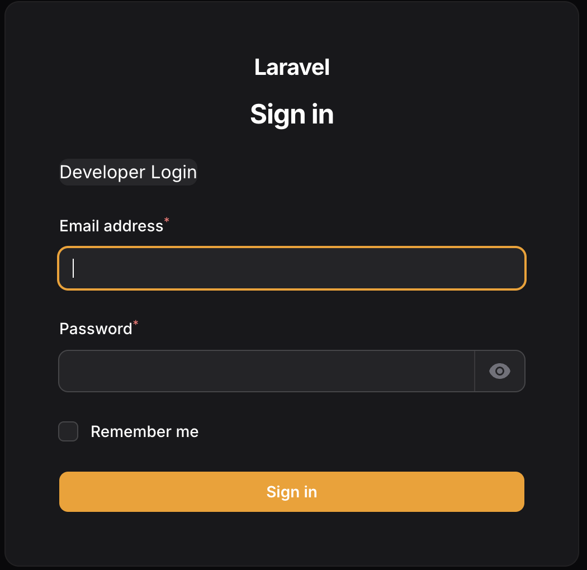
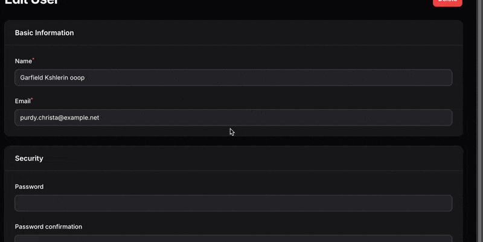
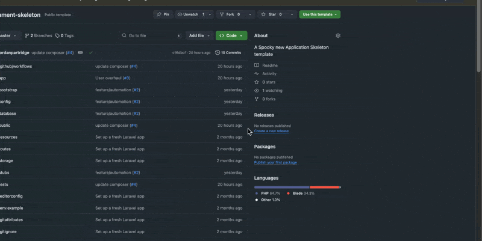

# Filament Skeleton

[](https://github.com/jordanpartridge/filament-skeleton/releases)
[](LICENSE.md)

## What's included

Filament template configured with some niceties
- [Filament pre-installed with Panels](https://filamentphp.com/docs/3.x/panels/installation)
- [Spatie Login Link](https://github.com/spatie/laravel-login-link) added to login screen
 
- [Filament Activity Log](https://github.com/pxlrbt/filament-activity-log) User event logging and restore functionality
      
- Advanced Permission Management System

## Getting Started
Option 1: Use Template in Github


## Permission Management System

The skeleton includes a robust permission management system built on top of Laravel's model system. This system provides fine-grained access control for all your models with minimal setup.

### Key Features

- Automatic CRUD permission generation for models
- Role-based access control
- Flexible permission naming conventions
- Easy integration with Filament resources
- Permission caching for optimal performance

### Basic Usage

1. Extend the BaseModel in your models:

```php
use App\Models\Base\BaseModel;

class Post extends BaseModel
{
    protected static function booted()
    {
        parent::booted();
        static::registerModelPermissions();
    }
}
```

2. Check permissions in your code:

```php
// In controllers
if ($post->checkPermission(auth()->user(), 'update')) {
    // Proceed with update
}

// In Blade templates
@can('update', $post)
    <button>Edit Post</button>
@endcan

// In Filament resources
public static function canViewAny(): bool
{
    return auth()->user()->can('view post');
}
```

### Custom Permissions

Add custom permissions beyond CRUD operations:

```php
class Post extends BaseModel
{
    public static function getStandardPermissions(): array
    {
        return array_merge(parent::getStandardPermissions(), [
            'publish',
            'archive'
        ]);
    }
}
```

### Middleware Integration

Protect your routes with the included middleware:

```php
Route::get('/posts/{post}/edit', [PostController::class, 'edit'])
    ->middleware('check.permission:update');
```

### Permission Naming Convention

Permissions follow a consistent naming pattern:
- `view post`
- `create post`
- `update post`
- `delete post`
- `publish post` (custom)
- `archive post` (custom)

### Best Practices

1. **Cache Permissions:**
   - Permissions are automatically cached
   - Cache is invalidated on model updates
   - Configurable cache duration

2. **Role Organization:**
   - Create roles based on business domains
   - Assign minimum required permissions
   - Use role inheritance where appropriate

3. **Security Considerations:**
   - Always check permissions on both frontend and backend
   - Use middleware for route protection
   - Implement proper permission checking in Filament resources

### Implementation Example

Here's a complete example of implementing permissions in a Filament resource:

```php
use App\Filament\Resources\PostResource;
use Filament\Resources\Resource;

class PostResource extends Resource
{
    public static function canViewAny(): bool
    {
        return auth()->user()->can('view post');
    }

    public static function canCreate(): bool
    {
        return auth()->user()->can('create post');
    }

    public static function canEdit(Model $record): bool
    {
        return auth()->user()->can('update post');
    }

    public static function canDelete(Model $record): bool
    {
        return auth()->user()->can('delete post');
    }

    // Custom action
    public function publish()
    {
        abort_unless(auth()->user()->can('publish post'), 403);
        // Publication logic
    }
}
```

### Command Line Tools

The skeleton includes artisan commands for permission management:

```bash
# List all permissions
php artisan permissions:list

# Sync permissions for all models
php artisan permissions:sync

# Clear permission cache
php artisan permissions:clear-cache
```

### Extending the System

You can extend the permission system by:

1. Creating custom permission providers
2. Adding new permission types
3. Implementing custom caching strategies
4. Adding permission inheritance
5. Creating permission groups

For more detailed information, check the [documentation](docs/permissions.md).